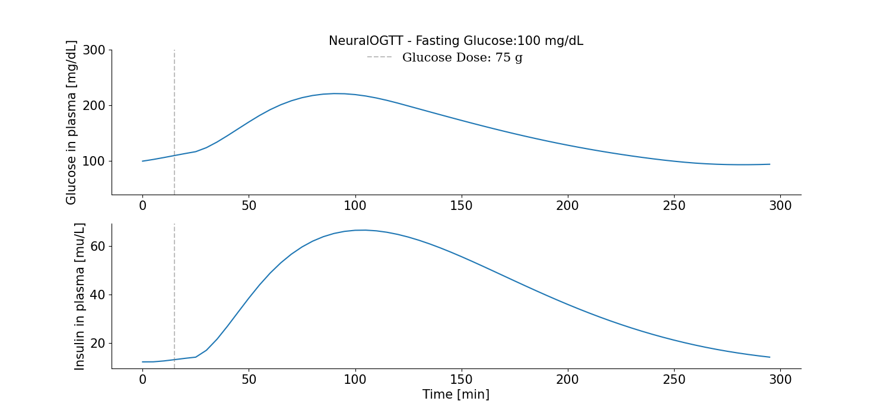
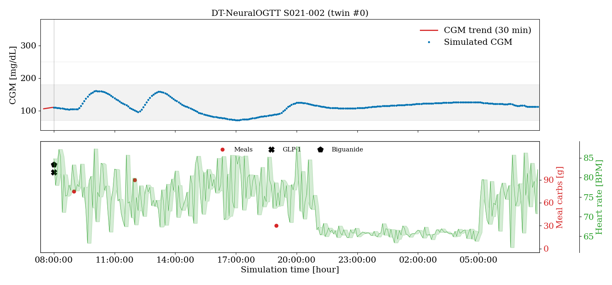

# T2DSim AI


-----

## Hybrid Neural Digital-Twin Framework for Type 2 Diabetes

Valentina Roquemen-Echeverri and Clara Mosquera-Lopez

This repository provides tools to simulate glucose-insulin dynamics in type 2 diabetes using:

- **NeuralOGTT**: population OGTT model from fasting glucose
- **DT-NeuralOGTT**: personalized digital twins integrating heart rate, sleep, medications, and temporal features

Read more: [Biocybernetics and Biomedical Engineering](https://www.sciencedirect.com/science/article/abs/pii/S0208521626000562)

## Table of Contents

- [Installation](#installation)
- [Simulation](#simulation)
- [Creation of a Digital Twin](#creation-of-a-digital-twin)
- [Citation](#citation)
- [License](#license)

## Installation

```console
pip install t2dsim-ai
```

For development:

```console
pip install -e ".[dev]"
```

## Simulation

### NeuralOGTT

Simulate a standard 75 g OGTT from fasting glucose only:

```bash
python example/runOGTT.py
```



### DT-NeuralOGTT

The package ships **40 pre-trained digital twins** in `src/t2dsim_ai/models/DigitalTwins/`. These were trained on real **T2Help** cohort data (April 2026 Bayesian-optimization runs) and are intended for inference out of the box.

Simulate one day for bundled digital twin `#0` using a scenario generated from the twin's `info.csv`:

```python
from t2dsim_ai import DigitalTwin, scenario_from_twin_info

twin = DigitalTwin(0)
df = scenario_from_twin_info(twin.digital_twin_Info)
result = twin.simulate(df)
```

Or run the example script:

```bash
python example/runDTNeuralOGTT.py
```



`scenario_from_twin_info()` builds heart-rate variability, medication traces, meals, sleep, and time features from each twin's metadata.

## Creation of a Digital Twin

Train a personalized digital twin from a subject CSV with CGM, heart rate, meals, medications, and sleep.

### Example training data (synthetic)

[`example/example_model/data_example.csv`](example/example_model/data_example.csv) is **synthetic mock data** (subject `example-001`, 7 days of scripted CGM/HR/meals/meds). It exists only to demonstrate the training workflow and smoke-test the pipeline—it is **not** real patient data and should not be used to evaluate model performance.

For research use, train on compiled subject CSVs from the T2Help study (processed with the T2D-simulator `read_dataset` pipeline). Optional demographic columns (`demog_*`) are written to `info.csv` when present in the input file.

### Required CSV columns

- `timestamp`
- `cgm_value`
- `heartRate_mean`, `heartRate_min`, `heartRate_max`, `heartRate_std`
- `meals_mealSize`
- `meds_medicationDose$rapid_acting_insulin`
- `grouped_meds_medicationGroup$sulfonylurea`
- `grouped_meds_medicationGroup$sglt2`
- `grouped_meds_medicationGroup$glp1`
- `grouped_meds_medicationGroup$biguanide`
- `sleep_efficiency`

Run training (default sequence length is 12 hours at 5-minute sampling; override with ``seq_len``):

```bash
python example/trainDigitalTwin.py
```

```python
from t2dsim_ai import train_digital_twin

train_digital_twin("subject.csv", "output/", seq_len=12 * 12)  # 12 h
```

This writes `model.pt`, `scaler_inputsPop.pkl`, and `info.csv` to `example/example_model/output/`.

Processing utilities (HR imputation, insulin on board, oral medication kernels) live in `t2dsim_ai.data_processing`.

To refresh bundled twins from the research repository (real T2Help subjects):

```bash
python scripts/sync_digital_twins.py
```

## Citation

If you used this package in your research, please cite it:

```
@Misc{,
    author = {Valentina Roquemen-Echeverri and Clara Mosquera-Lopez},
    title = {T2DSim AI},
    year = {2024--},
    url = "https://github.com/mosqueralopez/T2DSim_AI"
}
```

## License

This project is distributed under the OHSU research license in [`LICENSE`](LICENSE).

Use is permitted for non-profit research institutions, hospitals, and academic universities. Redistribution, sublicensing, and commercial use require written permission from the copyright holder.
