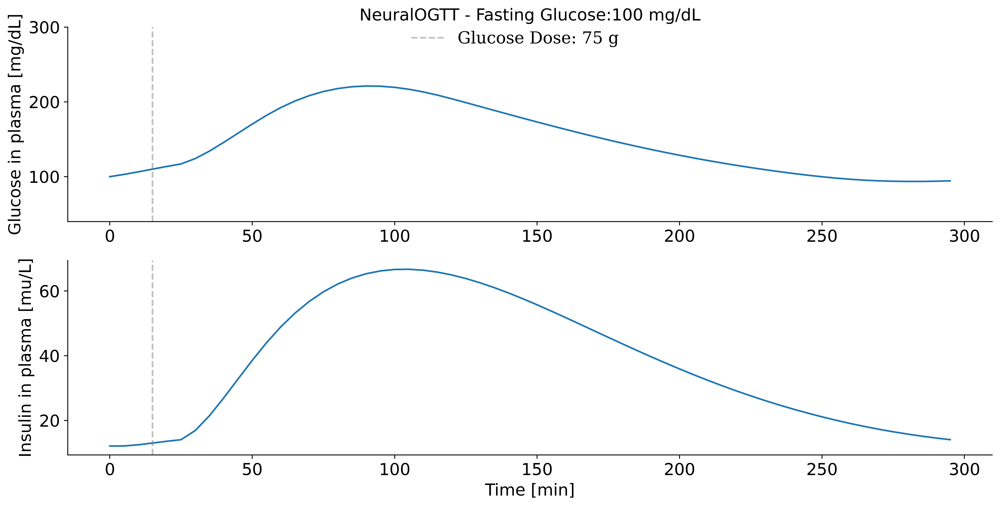

# T2DSim AI


-----

## Table of Contents

- [Installation](#installation)
- [Simulation: NeuralOGTT and DT-NeuralOGTT](#simulation-neuralogtt-and-dt-neuralogtt)
- [Creation of a Digital Twin](#creation-of-a-digital-twin)
- [Citation](#citation)
- [License](#license)

## Installation

```console
pip install t2dsim-ai
```
## Simulation: NeuralOGTT and DT-NeuralOGTT

### NeuralOGTT

NeuralOGTT is a novel hybrid approach to modeling glucose-insulin dynamics during the oral glucose tolerance test (OGTT).

Run the following command to simulate an OGTT, with the initial fasting glucose as the only input. To modify the input, change the variable `initCGM`.

```bash
python example/runOGTT.py
```

After running the example, the simulation will appear as follows for `initCGM = 100 mg/dL`:



### DT-NeuralOGTT

Digital twins are constructed by combining the NeuralOGTT with individual-level subnetworks to improve simulation accuracy though integration of additional glucose management and contextual data (e.g., heart rate, sleep data, and time-related features) to model inter- and intra-individual variability in glucose dynamics not modeled by NeuralOGTT.

Run the following command to simulate one day of the digital twin #0.

```bash
python example/runDTNeuralOGTT.py
```

After running the example, the simulation will look as follows:


## Creation of a Digital Twin

WIP

## Citation

If you used this package in your research, please cite it:

```
@Misc{,
    author = {Valentina Roquemen-Echeverri and Clara Mosquera-Lopez},
    title = {T2DSim AI},
    year = {2024--},
    url = "https://github.com/mosqueralopez/T2DSim_AI"
}
```

TODO: Add final work

## License

`t2dsim-ai` is distributed under the terms of the [MIT](https://spdx.org/licenses/MIT.html) license.
